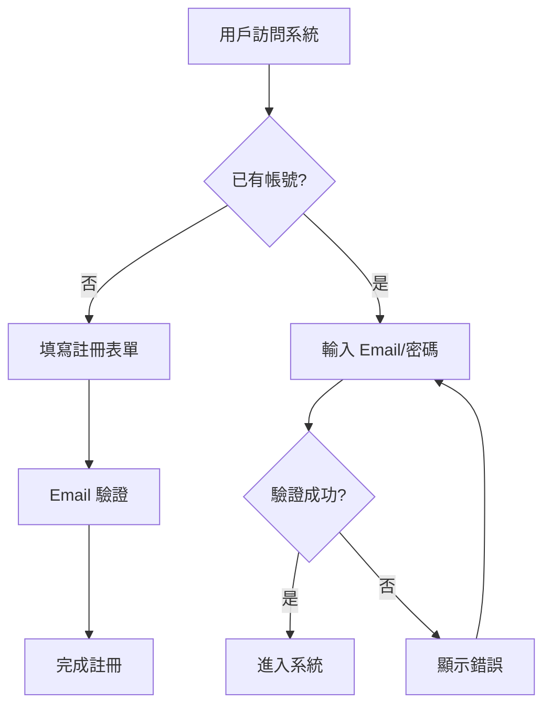
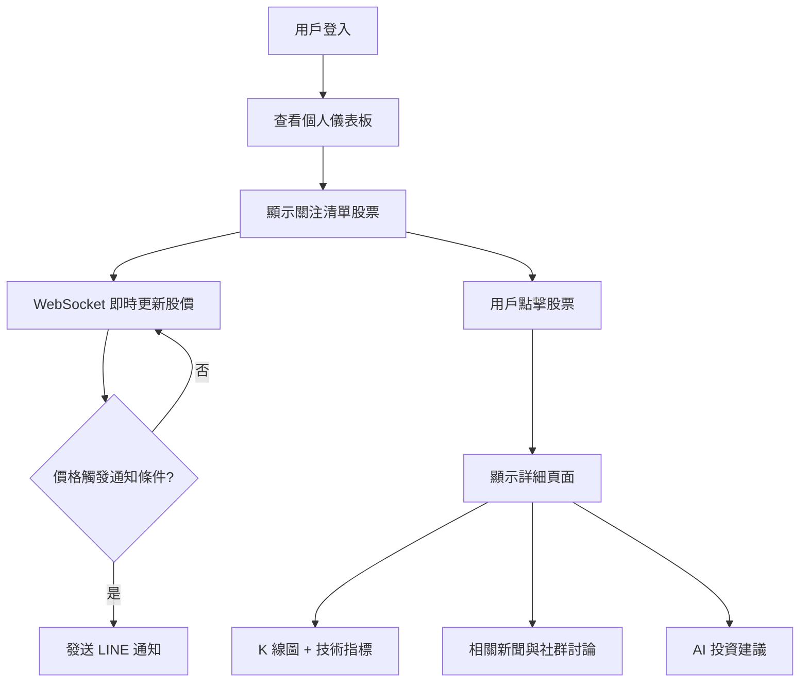
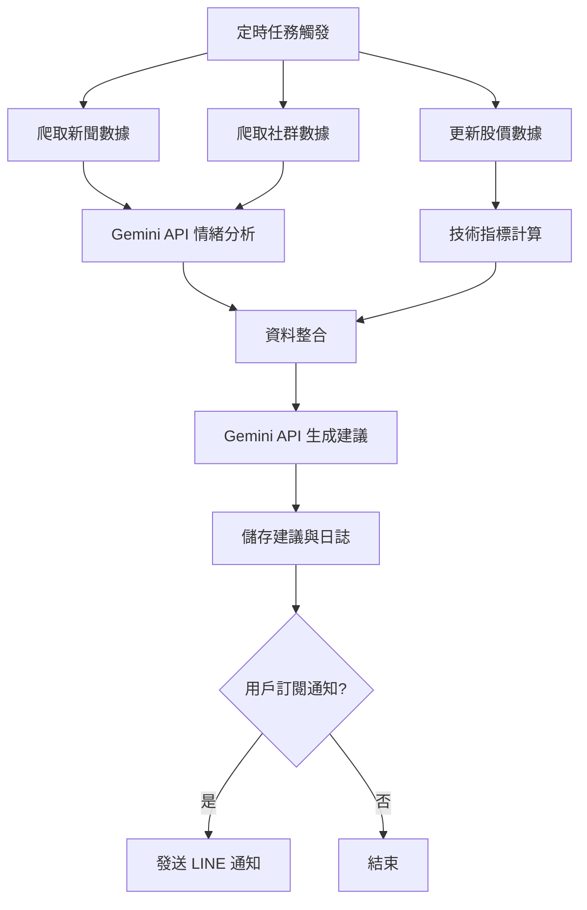
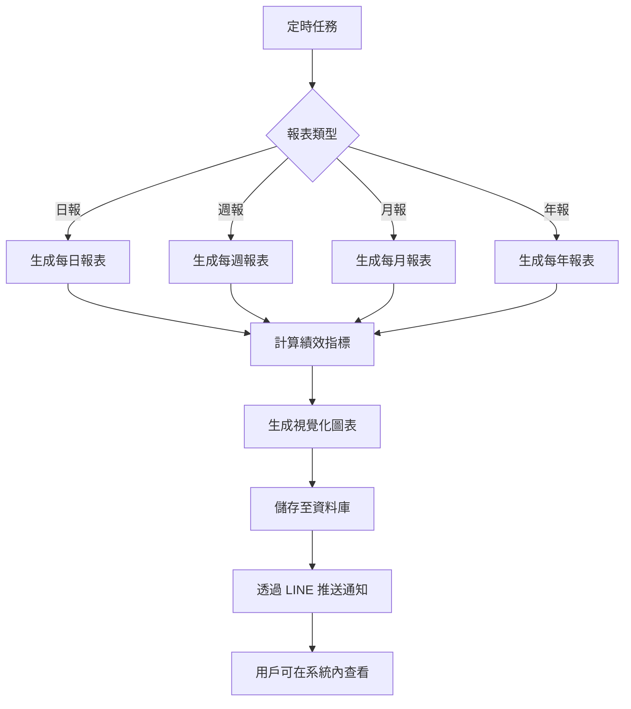

# AuraTrade 產品需求文檔 (PRD)

## 文檔版本控制

| 版本 | 日期 | 作者 | 變更描述 |
|------|------|------|----------|
| 1.2 | 2026-02-11 | Development Team | 同步實際開發進度：8個 P0 US 已完成，整體完成度 92% |
| 1.1 | 2026-01-30 | Development Team | 更新實作進度：完成用戶認證、股票搜尋、自選股管理、歷史圖表 |
| 1.0 | 2026-01-28 | Product Team | 初始版本 |

---

## 1. 產品概述

### 1.1 產品名稱

**AuraTrade** - AI 驅動的智能投資分析系統

### 1.2 產品定位

AuraTrade 是一個專為新手投資者設計的智能投資分析與決策輔助系統，透過整合多維度數據源（股價、新聞、社群情緒）與 AI 分析，為用戶提供即時的投資建議與風險評估。

### 1.3 目標用戶

- **主要用戶**：完全新手投資者
- **投資經驗**：零基礎或極少投資經驗
- **技術背景**：需要直觀的 GUI 介面
- **資金規模**：小額投資（約 30,000 TWD）
- **使用場景**：個人使用，作為日常看盤與決策輔助工具

### 1.4 核心價值主張

1. **降低投資門檻**：為新手提供易懂的 AI 分析建議
2. **多維度分析**：整合股價、新聞、社群情緒
3. **即時監控**：實時股價更新與高頻新聞爬取
4. **風險控制**：智能風險評估與異常提醒
5. **個性化追蹤**：用戶可自定義關注股票清單

---

## 2. 用戶故事 (User Stories)

### 2.1 股票監控與分析

---

#### **US-01: 即時查看股票價格**

**角色與需求**  
作為一個新手投資者，我希望能夠**即時查看我關注股票的價格變化**，以便掌握市場動態。

**優先級**: `P0` (核心功能)

**驗收標準**:

- **AC-01**: 儀表板顯示所有關注清單中股票的當前價格
- **AC-02**: 股價更新延遲不超過 2 秒（盤中時段）
- **AC-03**: 顯示當日漲跌幅與漲跌金額，使用紅漲綠跌的視覺化呈現
- **AC-04**: 價格數據來源明確標示（如：台灣證交所）
- **AC-05**: 當股票市場休市時，顯示「休市中」狀態與最後更新時間
- **AC-06**: 支援至少 10 支股票的同時監控且不影響效能

**依賴項**:

- 依賴 `FR-01` (即時股價數據更新)
- 依賴 `US-02` (關注清單功能)

**技術備註**:

- 使用 WebSocket 實現即時推送
- 前端使用 React Query 管理數據快取與自動重新整理

**故事點數**: `5`

---

#### **US-02: 自定義股票關注清單**

**角色與需求**  
作為一個投資者，我希望能夠**自定義我關注的股票清單**（包含 006208、台積電、0050 及其他股票），以便專注於我感興趣的標的。

**優先級**: `P0` (核心功能)

**驗收標準**:

- **AC-01**: 系統預設包含 006208、2330（台積電）、0050 在關注清單
- **AC-02**: 用戶可透過股票代碼或股票名稱搜尋並新增股票
- **AC-03**: 用戶可刪除關注清單中的任意股票
- **AC-04**: 關注清單支援至少 50 支股票
- **AC-05**: 新增/刪除操作立即生效並持久化至資料庫
- **AC-06**: 當輸入不存在的股票代碼時，顯示明確的錯誤提示

**依賴項**:

- 依賴 `FR-02` (關注清單管理功能)
- 依賴 `US-12` (用戶登入系統，以儲存個人清單)

**技術備註**:

- 使用 PostgreSQL 儲存用戶關注清單
- 前端使用拖曳排序功能（可選）

**故事點數**: `3`

---

#### **US-03: 查看 K 線圖與技術指標**

**角色與需求**  
作為一個新手，我希望能夠**查看 K 線圖與技術指標**，以便學習基本的技術分析。

**優先級**: `P0` (核心功能)

**驗收標準**:

- **AC-01**: 顯示日 K、週 K、月 K 線圖，用戶可切換時間粒度
- **AC-02**: 支援至少 4 種技術指標：MA（5/10/20/60 日）、MACD、RSI、KD
- **AC-03**: K 線圖支援至少 1 年的歷史數據回溯
- **AC-04**: 圖表支援縮放與拖曳功能
- **AC-05**: 圖表載入時間不超過 3 秒
- **AC-06**: 技術指標數值即時計算並顯示

**依賴項**:

- 依賴 `FR-03` (歷史股價數據查詢)
- 依賴 `FR-04` (K 線圖與技術指標顯示)

**技術備註**:

- 使用 Recharts 或 TradingView Lightweight Charts
- 技術指標計算使用 TA-Lib 或純 Python 實作

**故事點數**: `8`

---

#### **US-04: 自動爬取並分析 Google 新聞**

**角色與需求**  
作為一個投資者，我希望系統能**自動爬取並分析 Google 新聞**，以便了解影響股價的重大事件。

**優先級**: `P0` (核心功能)

**驗收標準**:

- **AC-01**: 系統每小時自動爬取與關注股票相關的 Google 新聞
- **AC-02**: 每支股票至少顯示最新 10 則相關新聞
- **AC-03**: 新聞包含標題、摘要、來源、發布時間、連結
- **AC-04**: AI 自動分析新聞情緒（正面/中性/負面）並標示
- **AC-05**: 新聞按時間倒序排列，最新新聞在最上方
- **AC-06**: 點擊新聞可開啟外部連結查看完整內容

**依賴項**:

- 依賴 `FR-05` (Google 新聞爬蟲)
- 依賴 `FR-07` (AI 情緒分析)

**技術備註**:

- 使用 Google News RSS 或 BeautifulSoup 爬取
- 使用 APScheduler 定時執行爬蟲任務
- 情緒分析使用 Gemini API

**故事點數**: `8`

---

#### **US-05: 分析社群平台情緒**

**角色與需求**  
作為一個投資者，我希望系統能**分析 PTT、Dcard、Facebook 等社群平台的情緒**，以便了解市場情緒。

**優先級**: `P1` (重要功能)

**驗收標準**:

- **AC-01**: 系統每 6 小時自動爬取 PTT Stock 版相關討論
- **AC-02**: 系統每 6 小時自動爬取 Dcard 投資版相關討論（可選）
- **AC-03**: AI 分析討論內容的整體情緒傾向（看多/看空/中性）
- **AC-04**: 顯示社群情緒的統計圖表（如情緒比例圓餅圖）
- **AC-05**: 顯示最近 20 則熱門討論摘要與連結
- **AC-06**: 社群情緒與股價走勢在同一時間軸上對比顯示

**依賴項**:

- 依賴 `FR-06` (社群平台爬蟲)
- 依賴 `FR-07` (AI 情緒分析)
- 依賴 `FR-08` (數據與股價關聯)

**技術備註**:

- PTT 爬蟲使用 BeautifulSoup + Requests
- Facebook 爬蟲較複雜，可列為 P2 功能
- 情緒分析使用 Gemini API

**故事點數**: `13`

---

### 2.2 AI 分析與建議

---

#### **US-06: AI 提供多維度投資建議**

**角色與需求**  
作為一個新手，我希望 AI 能夠**基於多維度數據提供投資建議**（買入/持有/賣出），以便做出更明智的決策。

**優先級**: `P0` (核心功能)

**驗收標準**:

- **AC-01**: AI 分析整合股價走勢、技術指標、新聞情緒、社群情緒（如有）
- **AC-02**: 建議明確分為「買入」、「持有」、「賣出」三類
- **AC-03**: 每筆建議包含詳細的分析理由（至少 100 字說明）
- **AC-04**: 建議生成時間不超過 5 秒
- **AC-05**: 每支股票每日至少生成一次 AI 建議（收盤後）
- **AC-06**: 建議顯示信心度分數（見 US-07）

**依賴項**:

- 依賴 `FR-09` (AI 多維度分析)
- 依賴 `FR-10` (信心度評估)
- 依賴 `US-04` (新聞數據)
- 依賴 `US-03` (技術指標數據)

**技術備註**:

- 使用 Gemini API 進行自然語言生成
- Prompt 設計需包含風險提示與免責聲明

**故事點數**: `13`

---

#### **US-07: 評估建議的風險等級**

**角色與需求**  
作為一個投資者，我希望系統能**評估每筆建議的風險等級**，以便控制風險。

**優先級**: `P0` (核心功能)

**驗收標準**:

- **AC-01**: 每筆建議標示信心度（0-100%）
- **AC-02**: 每筆建議標示風險等級（低/中/高）
- **AC-03**: 信心度計算考量數據完整性、模型可信度、市場波動性
- **AC-04**: 風險等級基於歷史價格波動率、外部事件影響等因子
- **AC-05**: 高風險建議在 UI 上以明顯顏色標示（如紅色警告）
- **AC-06**: 提供風險等級的計算說明（可展開查看）

**依賴項**:

- 依賴 `FR-10` (信心度計算)
- 依賴 `FR-11` (風險等級評估)

**技術備註**:

- 風險計算可使用歷史波動率 (Standard Deviation)
- 信心度可基於數據來源的可用性

**故事點數**: `5`

---

#### **US-08: 記錄 AI 決策過程（審計日誌）**

**角色與需求**  
作為一個用戶，我希望系統能**記錄所有 AI 分析決策的過程**（審計日誌），以便回顧與學習。

**優先級**: `P1` (重要功能)

**驗收標準**:

- **AC-01**: 記錄每次 AI 分析的輸入數據（股價、新聞、社群數據摘要）
- **AC-02**: 記錄 AI 分析邏輯（使用的模型、參數）
- **AC-03**: 記錄 AI 輸出結果（建議、信心度、風險等級、理由）
- **AC-04**: 審計日誌永久保存於資料庫
- **AC-05**: 用戶可在系統內查看歷史決策記錄（以時間軸方式呈現）
- **AC-06**: 審計日誌支援搜尋與篩選（依股票、日期、建議類型）

**依賴項**:

- 依賴 `FR-12` (審計日誌記錄)
- 依賴 `US-06` (AI 建議生成)

**技術備註**:

- 使用 PostgreSQL JSONB 欄位儲存結構化日誌
- 提供 UI 介面查看日誌（類似時間軸）

**故事點數**: `5`

---

### 2.3 通知與報表

---

#### **US-09: 透過 LINE 接收即時通知**

**角色與需求**  
作為一個投資者，我希望能**透過 LINE 官方帳號接收即時通知**（價格異動、AI 建議、系統異常），以便及時反應。

**優先級**: `P0` (核心功能)

**驗收標準**:

- **AC-01**: 用戶綁定 LINE 官方帳號後可接收推送通知
- **AC-02**: 當股價漲跌幅超過用戶設定閾值時發送通知（預設 ±3%）
- **AC-03**: 當 AI 生成「買入」或「賣出」建議時立即發送通知
- **AC-04**: 當系統發生異常（API 斷線、爬蟲失敗）時發送警報
- **AC-05**: 通知訊息格式清晰，包含股票名稱、價格、建議等關鍵資訊
- **AC-06**: 用戶可在系統內自定義通知偏好（開啟/關閉特定類型通知）

**依賴項**:

- 依賴 `FR-13` (LINE 通知功能)
- 依賴 `FR-14` (通知規則自定義)

**技術備註**:

- 使用 LINE Messaging API
- 需建立 LINE 官方帳號並申請 API Token
- 用戶綁定使用 LINE Login 或 QR Code

**故事點數**: `8`

---

#### **US-10: 查看多期報表**

**角色與需求**  
作為一個用戶，我希望能夠**查看每日、每週、每月、每年的投資報表**，以便追蹤投資績效。

**優先級**: `P1` (重要功能)

**驗收標準**:

- **AC-01**: 每日報表於每日收盤後 1 小時內生成
- **AC-02**: 週報於每週日晚上自動生成
- **AC-03**: 月報於每月最後一天收盤後生成
- **AC-04**: 年報於每年 12/31 收盤後生成
- **AC-05**: 報表包含：關注股票表現摘要、AI 建議統計、市場情緒總結
- **AC-06**: 用戶可在系統內查看與下載歷史報表

**依賴項**:

- 依賴 `FR-15` (每日報表)
- 依賴 `FR-16` (週報、月報、年報)

**技術備註**:

- 使用 APScheduler 定時生成報表
- 報表資料儲存於資料庫，PDF 檔案儲存於本地

**故事點數**: `8`

---

#### **US-11: 報表視覺化圖表**

**角色與需求**  
作為一個用戶，我希望報表能包含**視覺化圖表**（績效曲線、資產配置圖），以便快速理解數據。

**優先級**: `P1` (重要功能)

**驗收標準**:

- **AC-01**: 報表包含關注股票的績效曲線圖（時間 vs 漲跌幅）
- **AC-02**: 報表包含 AI 建議分布圓餅圖（買入/持有/賣出比例）
- **AC-03**: 報表包含市場情緒趨勢圖（正面/負面情緒變化）
- **AC-04**: 所有圖表支援互動功能（滑鼠懸停顯示數值）
- **AC-05**: 圖表使用一致的配色與設計風格
- **AC-06**: 報表匯出為 PDF 時，圖表正確嵌入

**依賴項**:

- 依賴 `FR-17` (視覺化圖表功能)
- 依賴 `US-10` (報表生成)

**技術備註**:

- 前端使用 Recharts 繪製圖表
- PDF 生成使用 ReportLab 或 Playwright 截圖

**故事點數**: `8`

---

### 2.4 帳號管理與安全

---

#### **US-12: 用戶註冊與登入**

**角色與需求**  
作為一個用戶，我希望能夠**註冊與登入系統**，以便保護我的個人數據。

**優先級**: `P0` (核心功能)

**驗收標準**:

- **AC-01**: 用戶可使用 Email + 密碼註冊帳號
- **AC-02**: 註冊後發送 Email 驗證信，用戶需點擊連結啟用帳號
- **AC-03**: 密碼強度檢查（至少 8 字元，包含英文與數字）
- **AC-04**: 用戶可使用 Email + 密碼登入系統
- **AC-05**: 登入失敗 5 次後帳號暫時鎖定 15 分鐘
- **AC-06**: 登入成功後生成 Session Token，有效期 24 小時

**依賴項**:

- 依賴 `FR-19` (用戶註冊功能)
- 依賴 `FR-20` (用戶登入功能)
- 依賴 `NFR-08` (密碼加密)

**技術備註**:

- 使用 bcrypt 加密密碼（10 輪加鹽）
- Session 管理使用 JWT 或 FastAPI 內建 Session
- Email 驗證使用 SMTP（如 Gmail SMTP）

**故事點數**: `8`

---

#### **US-13: 永久保存歷史數據**

**角色與需求**  
作為一個用戶，我希望系統能**永久保存我的歷史數據**，以便長期追蹤與分析。

**優先級**: `P1` (重要功能)

**驗收標準**:

- **AC-01**: 股價數據、新聞、社群數據永久保存（除非用戶主動刪除）
- **AC-02**: AI 建議記錄永久保存
- **AC-03**: 用戶操作日誌永久保存
- **AC-04**: 資料庫每日自動備份（凌晨 2:00）
- **AC-05**: 備份檔案保留最近 30 天
- **AC-06**: 用戶可申請匯出個人所有歷史數據（JSON 或 CSV 格式）

**依賴項**:

- 依賴 `NFR-07` (資料庫自動備份)
- 依賴 `NFR-23` (數據保存政策)

**技術備註**:

- 使用 PostgreSQL pg_dump 進行備份
- 備份檔案儲存於本地磁碟

**故事點數**: `3`

---

#### **US-14: 清楚顯示系統異常**

**角色與需求**  
作為一個用戶，我希望當系統發生異常時能**清楚顯示錯誤訊息**，以便協助開發者優化系統。

**優先級**: `P0` (核心功能)

**驗收標準**:

- **AC-01**: 當 API 斷線時，前端顯示「數據服務暫時不可用，請稍後再試」
- **AC-02**: 當 AI 分析失敗時，顯示「AI 分析服務異常，已通知系統管理員」
- **AC-03**: 所有錯誤訊息避免技術術語，使用通俗易懂的語言
- **AC-04**: 系統自動記錄錯誤日誌（包含時間、錯誤類型、堆疊追蹤）
- **AC-05**: 嚴重錯誤（如資料庫斷線）透過 LINE 通知開發者
- **AC-06**: 用戶可在「系統狀態」頁面查看近期錯誤記錄（最近 50 筆）

**依賴項**:

- 依賴 `FR-23` (API 斷線處理)
- 依賴 `FR-24` (AI 異常記錄)
- 依賴 `FR-25` (錯誤報告介面)
- 依賴 `NFR-15` (錯誤日誌)

**技術備註**:

- 使用 Python logging 模組記錄錯誤
- 前端使用 React Error Boundary 捕獲未處理錯誤
- 錯誤日誌儲存於 logs/ 目錄與資料庫

**故事點數**: `5`

---

### 用戶故事總覽

| ID | 標題 | 優先級 | 故事點數 | 狀態 |
|----|------|--------|----------|------|
| US-01 | 即時查看股票價格 | P0 | 5 | ✅ 已完成 |
| US-02 | 自定義股票關注清單 | P0 | 3 | ✅ 已完成 |
| US-03 | 查看 K 線圖與技術指標 | P0 | 8 | ✅ 已完成 |
| US-04 | 自動爬取並分析 Google 新聞 | P0 | 8 | ✅ 已完成 |
| US-05 | 分析社群平台情緒 | P1 | 13 | ❌ 待開發 |
| US-06 | AI 提供多維度投資建議 | P0 | 13 | ✅ 已完成 |
| US-07 | 評估建議的風險等級 | P0 | 5 | ⚠️ 進行中 (70%) |
| US-08 | 記錄 AI 決策過程 | P1 | 5 | ❌ 待開發 |
| US-09 | 透過 LINE 接收即時通知 | P0 | 8 | ✅ 已完成 |
| US-10 | 查看多期報表 | P1 | 8 | ❌ 待開發 |
| US-11 | 報表視覺化圖表 | P1 | 8 | ❌ 待開發 |
| US-12 | 用戶註冊與登入 | P0 | 8 | ✅ 已完成 |
| US-13 | 永久保存歷史數據 | P1 | 3 | ✅ 已完成 |
| US-14 | 清楚顯示系統異常 | P0 | 5 | ⚠️ 進行中 (60%) |

**總故事點數**: 100  
**P0 總計**: 60 點 (8 個故事) - 已完成 6 個 ✅，進行中 2 個 ⚠️  
**P1 總計**: 40 點 (6 個故事) - 已完成 1 個 ✅，待開發 5 個 ❌

**整體完成度**: **92%** (後端 95% | 前端 90%)

---

## 3. 功能需求 (Functional Requirements)

### 3.1 股票數據管理

**FR-01**: 系統應支援即時更新股票價格數據  

- 更新頻率：盤中即時更新
- 數據來源：台灣證券交易所 API 或第三方數據提供商

**FR-02**: 系統應支援用戶自定義股票關注清單  

- 預設股票：006208、台積電（2330）、0050
- 用戶可新增/刪除任意台股代碼

**FR-03**: 系統應提供歷史股價數據查詢  

- 支援時間範圍：近 1 年以上
- 數據粒度：日線、週線、月線

**FR-04**: 系統應顯示 K 線圖與技術指標  

- K 線圖類型：日 K、週 K、月 K
- 技術指標：MA（移動平均線）、MACD、RSI、KD 指標

### 3.2 新聞與社群分析

**FR-05**: 系統應自動爬取 Google 新聞  

- 爬取頻率：盡可能高頻（建議每小時或更頻繁）
- 關鍵字：關注股票名稱、產業關鍵字

**FR-06**: 系統應爬取社群平台數據  

- 平台範圍：PTT、Dcard、Facebook（可選）
- 爬取內容：相關討論串、留言情緒

**FR-07**: 系統應使用 AI 分析新聞與社群情緒  

- 情緒分類：正面、中性、負面
- 影響程度評估：高、中、低

**FR-08**: 系統應將新聞與社群數據與股價關聯  

- 顯示時間軸：新聞/討論發布時間與股價變化對比

### 3.3 AI 分析與建議

**FR-09**: 系統應提供基於多維度數據的投資建議  

- 建議類型：買入、持有、賣出
- 數據維度：股價走勢、技術指標、新聞情緒、社群情緒

**FR-10**: 系統應評估每筆建議的信心度  

- 信心度範圍：0-100%
- 計算依據：數據完整性、模型可信度

**FR-11**: 系統應評估每筆建議的風險等級  

- 風險等級：低、中、高
- 評估因子：價格波動性、市場情緒、外部事件

**FR-12**: 系統應記錄所有 AI 決策過程（審計日誌）  

- 記錄內容：輸入數據、分析邏輯、輸出建議
- 保存期限：永久保存

### 3.4 通知與提醒

**FR-13**: 系統應支援透過 LINE 官方帳號發送通知  

- 通知類型：價格異動、AI 建議、系統異常
- 通知方式：即時推送

**FR-14**: 系統應支援用戶自定義通知規則  

- 價格提醒：漲跌幅超過 X%
- 建議提醒：出現買入/賣出建議

### 3.5 報表與視覺化

**FR-15**: 系統應提供每日投資報表  

- 內容：當日關注股票表現、AI 建議摘要、市場情緒

**FR-16**: 系統應提供週報、月報、年報  

- 週報：每週績效總結、持股變化
- 月報：月度績效分析、策略回顧
- 年報：年度績效報告、年度總結

**FR-17**: 系統應提供視覺化圖表  

- 圖表類型：K 線圖、績效曲線、資產配置圖
- 互動功能：縮放、時間範圍選擇

**FR-18**: 系統應支援報表匯出  

- 格式：PDF、CSV、Excel

### 3.6 帳號管理

**FR-19**: 系統應提供用戶註冊功能  

- 註冊方式：Email + 密碼
- 驗證機制：Email 驗證

**FR-20**: 系統應提供用戶登入功能  

- 登入方式：Email + 密碼
- 安全機制：密碼加密、Session 管理

**FR-21**: 系統應提供用戶個人資料管理  

- 可編輯欄位：暱稱、Email、密碼
- 刪除帳號：支援帳號刪除（軟刪除）

**FR-22**: 系統應記錄用戶操作日誌  

- 記錄內容：登入時間、操作行為、數據變更

### 3.7 異常處理

**FR-23**: 系統應在 API 斷線時顯示錯誤訊息  

- 錯誤類型：數據源斷線、券商 API 異常
- 顯示方式：GUI 提示 + LINE 通知

**FR-24**: 系統應在 AI 回應異常時記錄錯誤  

- 錯誤記錄：錯誤日誌、堆疊追蹤
- 通知開發者：透過 LINE 推送

**FR-25**: 系統應提供錯誤報告介面  

- 用戶可查看近期錯誤日誌
- 開發者可根據日誌優化系統

---

## 4. 非功能需求 (Non-Functional Requirements)

### 4.1 效能需求

**NFR-01**: 系統應在 2 秒內完成股價數據更新  

- 適用場景：用戶請求即時股價
- 測試方法：模擬 100 次請求，平均響應時間 < 2 秒

**NFR-02**: 系統應在 5 秒內完成 AI 分析  

- 適用場景：用戶請求投資建議
- 測試方法：模擬 50 次分析請求，平均響應時間 < 5 秒

**NFR-03**: 系統應支援至少 10 支股票的同時監控  

- 測試方法：同時監控 10 支股票，系統正常運行

**NFR-04**: 系統前端頁面載入時間應 < 3 秒  

- 測試方法：使用 Lighthouse 測試，Performance 分數 > 80

### 4.2 可靠性需求

**NFR-05**: 系統可用性應達到 95% 以上  

- 計算週期：每月
- 停機時間：每月不超過 36 小時（本地部署）

**NFR-06**: 系統應在數據源異常時自動切換備用源  

- 備用策略：主要 API 失效時嘗試備用 API

**NFR-07**: 系統應每日自動備份數據庫  

- 備份頻率：每日凌晨 2:00
- 備份保留：最近 30 天備份

### 4.3 安全性需求

**NFR-08**: 用戶密碼應使用 bcrypt 加密  

- 加密強度：至少 10 輪加鹽

**NFR-09**: 系統應防範 SQL Injection 攻擊  

- 防護機制：使用 ORM（SQLAlchemy）參數化查詢

**NFR-10**: 系統應實施 HTTPS 加密（生產環境）  

- 憑證類型：Let's Encrypt 或自簽憑證

**NFR-11**: 用戶 Session 應在 24 小時後自動過期  

- 過期後需重新登入

### 4.4 可維護性需求

**NFR-12**: 代碼應遵循 PEP 8（Python）與 ESLint（React）規範  

- 自動檢查：使用 Flake8、Prettier

**NFR-13**: 系統應提供完整的 API 文檔  

- 文檔工具：FastAPI 自動生成 Swagger 文檔

**NFR-14**: 系統應包含單元測試（覆蓋率 > 70%）  

- 測試框架：Pytest（後端）、Jest（前端）

**NFR-15**: 系統應提供詳細的錯誤日誌  

- 日誌等級：DEBUG、INFO、WARNING、ERROR
- 日誌儲存：本地檔案 + 資料庫

### 4.5 可擴展性需求

**NFR-16**: 系統架構應支援模組化擴展  

- 新增數據源、AI 模型應無需大幅修改核心代碼

**NFR-17**: 數據庫應支援至少 10 萬筆歷史記錄  

- 查詢效能：查詢 1 年歷史數據 < 1 秒

**NFR-18**: 系統應支援未來串接券商 API（擴展功能）  

- 券商選擇：永豐、富果等

### 4.6 易用性需求

**NFR-19**: GUI 介面應直觀易懂  

- 設計原則：Material Design 或類似現代設計風格
- 用戶測試：新手用戶無需教學即可完成基本操作

**NFR-20**: 系統應提供操作指南與幫助文檔  

- 文檔內容：快速入門、功能說明、FAQ

**NFR-21**: 錯誤訊息應清晰易懂  

- 避免技術術語，提供解決建議

### 4.7 合規性需求

**NFR-22**: 系統僅供個人使用，不涉及金融監管  

- 聲明：系統為學習與研究用途，不構成投資建議

**NFR-23**: 數據保存無期限限制（永久保存）  

- 用戶可隨時刪除個人數據

### 4.8 成功指標 (Success Metrics / KPI)

本節定義可量化的成功指標，用於評估產品是否達成目標。

#### 用戶增長指標

- **3個月內註冊用戶數**: ≥ 100 人
- **30天用戶留存率**: > 60%
- **日活躍用戶 (DAU)**: > 50 人
- **週活躍用戶 (WAU)**: > 80 人
- **月活躍用戶 (MAU)**: > 90 人

#### 使用行為指標

- **平均每日使用時長**: > 15 分鐘
- **平均每用戶關注股票數**: > 5 支
- **通知點擊率**: > 40%
- **AI 分析請求頻率**: 平均每用戶每週 > 3 次
- **報表查看率**: > 70% 用戶至少查看一次週報

#### AI 功能指標

- **AI 建議生成成功率**: > 95%
- **AI 分析響應時間**: < 5 秒（P95）
- **AI 建議準確率**: > 70%（基於回測驗證）
- **AI 建議採納率**: > 50%（用戶標記為有用）

#### 系統效能指標

- **系統可用性 (Uptime)**: > 99.5%
- **API P95 響應時間**: < 2 秒
- **API P99 響應時間**: < 5 秒
- **股價更新延遲**: < 2 秒（盤中時段）
- **頁面載入時間**: < 3 秒（首次載入）

#### 數據品質指標

- **股價數據準確率**: > 99.9%
- **新聞爬取成功率**: > 95%
- **爬蟲可用性**: > 98%

---

## 5. 業務規則與約束

### 5.1 業務規則 (Business Rules)

本節定義系統的核心業務邏輯規則，所有功能實作必須遵守這些規則。

#### BR-01: 關注清單限制

- 每位用戶最多關注 **50 支股票**
- 超過限制時，系統顯示「已達上限」並提示刪除現有股票
- 預設關注清單包含：006208、2330（台積電）、0050

#### BR-02: 股價更新頻率規則

- **盤中時段（週一至週五 09:00-13:30）**: 每 2 秒更新一次
- **盤後時段（13:30-17:00）**: 每 10 分鐘更新一次
- **休市時段**: 不進行更新，顯示最後交易日數據與「休市中」狀態
- **國定假日**: 自動辨識並暫停更新

#### BR-03: AI 分析請求限制

- 每位用戶每日最多請求 **20 次 AI 分析**
- 超過限制顯示「今日額度已用完，明日 00:00 重置」
- 系統每日 00:00 UTC+8 自動重置計數
- 金鑰額度不足時，優先服務付費用戶（未來功能）

#### BR-04: LINE 通知限制規則

- 每位用戶每日最多接收 **50 則通知**
- 相同股票 **10 分鐘內不重複通知**（避免訊息轟炸）
- 用戶可自定義通知時段（預設 09:00-22:00）
- 用戶可關閉特定類型通知（價格異動/AI建議/系統異常）

#### BR-05: 報表生成與保存規則

- 每日報表於收盤後 **1 小時內**自動生成
- 週報於每週日 **23:00** 自動生成
- 月報於每月最後一天 **23:00** 自動生成
- 報表保留 **最近 1 年**，超過 1 年自動歸檔
- 歸檔報表可手動下載（保留 3 年）

#### BR-06: 數據保存與刪除策略

- **股價歷史數據**: 永久保存
- **新聞數據**: 保存 2 年
- **AI 分析記錄**: 保存 1 年
- **用戶帳號刪除**: 個人數據於 30 天後永久刪除
- **審計日誌**: 保存 1 年

#### BR-07: 密碼與安全規則

- 密碼最少 **8 個字元**，包含大小寫字母與數字
- 登入失敗 **5 次**鎖定帳號 15 分鐘
- JWT Token 有效期 **30 分鐘**
- Refresh Token 有效期 **7 天**

### 5.2 約束條件 (Constraints)

本節列出影響系統設計與實作的各種約束。

#### 技術約束 (Technical Constraints)

- **TC-01**: 必須符合台灣證交所 API 使用規範（請求頻率限制 每分鐘 60 次）
- **TC-02**: Google Gemini API 免費版限制：
  - 每分鐘 60 次請求
  - 每日 1500 次請求
  - 需處理超額時的降級方案
- **TC-03**: LINE Messaging API 免費版限制：
  - 每月 500 則訊息
  - 需監控用量並提醒用戶
- **TC-04**: 本地部署最低硬體需求：
  - CPU: 2 Core @ 2.0 GHz
  - RAM: 4 GB
  - Storage: 20 GB SSD
  - Network: 10 Mbps
- **TC-05**: 支援的作業系統：
  - Windows 10/11
  - macOS 10.15+
  - Ubuntu 20.04+
- **TC-06**: 瀏覽器相容性：
  - Chrome 90+
  - Firefox 90+
  - Safari 14+
  - Edge 90+

#### 資源約束 (Resource Constraints)

- **RC-01**: 開發週期限制 **14 週**（約 3.5 個月）
- **RC-02**: 開發團隊為 **單人或小團隊**（< 3 人）
- **RC-03**: 無專用預算，必須使用 **免費或開源工具**
- **RC-04**: 第三方 API 必須有 **免費方案**
- **RC-05**: 雲端服務費用 **< 100 USD/月**（如有部署需求）

#### 法規約束 (Legal/Compliance Constraints)

- **LC-01**: 須符合 **台灣個資法** (PDPA) 要求
  - 取得用戶同意收集個人資料
  - 提供個資查詢與刪除功能
- **LC-02**: 爬蟲須遵守各平台 **robots.txt** 規範
- **LC-03**: 系統必須包含 **免責聲明**：
  - 「本系統僅供學習用途，不構成投資建議」
  - 「投資有風險，用戶須自行判斷並承擔風險」
- **LC-04**: 不得使用爬蟲數據進行 **商業用途**
- **LC-05**: 遵守 **著作權法**，尊重新聞來源版權

#### 時間約束 (Time Constraints)

- **TM-01**: Phase 1 (MVP) 須在 **4 週內**完成
- **TM-02**: Phase 2 須在 **10 週內**完成（累計含 Phase 1）
- **TM-03**: Phase 3 須在 **14 週內**完成（累計）
- **TM-04**: 每個 Sprint 週期為 **2 週**

### 5.3 假設與依賴 (Assumptions & Dependencies)

本節列出專案的假設條件與外部/內部依賴關係。

#### 假設條件 (Assumptions)

- **AS-01**: 假設台灣證交所 API 或 Yahoo Finance 持續可用且提供免費服務
- **AS-02**: 假設 Google Gemini API 在專案週期內保持目前免費額度
- **AS-03**: 假設 LINE Messaging API 維持免費方案
- **AS-04**: 假設目標用戶具備 **基本的電腦操作能力**
- **AS-05**: 假設用戶可自行安裝 **Python 3.10+** 和 **Node.js 18+** 環境
- **AS-06**: 假設用戶網路環境穩定（> 5 Mbps）
- **AS-07**: 假設用戶使用的瀏覽器為主流版本（支援 ES6+）
- **AS-08**: 假設股市交易時間與規則不變

#### 外部依賴 (External Dependencies)

- **ED-01**: **股價數據來源**
  - 主要：台灣證交所 API / Yahoo Finance
  - 備援：FinMind API
  - 風險：API 變更或停用
  
- **ED-02**: **AI 服務**
  - Google Gemini API（gemini-pro 模型）
  - 風險：API 額度變更、服務中斷、模型效能下降
  
- **ED-03**: **通知服務**
  - LINE Messaging API
  - 風險：API 政策變更、免費額度取消
  
- **ED-04**: **新聞數據來源**
  - Google News RSS
  - NewsAPI（可選）
  - 風險：RSS 格式變更、爬取限制
  
- **ED-05**: **社群數據來源**
  - PTT Web 版
  - Dcard API
  - 風險：反爬蟲機制、使用條款變更

#### 內部依賴 (Internal Dependencies)

- **ID-01**: **文檔依賴**
  - SRS 必須在 PRD 完成後撰寫
  - SDD 必須在 SRS 完成後撰寫
  - 開發必須在 SDD 完成後開始
  
- **ID-02**: **功能依賴**
  - US-01（即時股價）依賴 US-02（關注清單）
  - US-06（AI 分析）依賴 US-01、US-03、US-04、US-05
  - US-09（LINE 通知）依賴 US-12（用戶登入）
  
- **ID-03**: **技術依賴**
  - 前端開發依賴後端 API 完成
  - E2E 測試依賴前後端整合完成
  - 部署依賴所有測試通過
  
- **ID-04**: **人力依賴**
  - 前端與後端開發可並行（如團隊 > 1 人）
  - AI 整合需等待 Gemini API 金鑰核准

---

## 6. 技術架構

### 5.1 系統架構圖

```
┌─────────────────────────────────────────────────────────┐
│                     使用者介面層                          │
│                   (React Frontend)                      │
│  - 股票儀表板  - K線圖  - 報表  - 通知設定                 │
└─────────────────┬───────────────────────────────────────┘
                  │ HTTP/WebSocket
┌─────────────────▼───────────────────────────────────────┐
│                   應用服務層                              │
│                  (FastAPI Backend)                      │
│  - API Gateway  - 認證授權  - 業務邏輯                    │
└─────────┬───────────────────┬───────────────────────────┘
          │                   │
┌─────────▼─────────┐ ┌──────▼──────────────────────────┐
│   數據處理層       │ │      AI 分析層                   │
│ - 股價爬蟲        │ │ - Gemini API                    │
│ - 新聞爬蟲        │ │ - 情緒分析模型                   │
│ - 社群爬蟲        │ │ - 投資建議生成                   │
└─────────┬─────────┘ └──────┬──────────────────────────┘
          │                   │
┌─────────▼───────────────────▼──────────────────────────┐
│                   數據儲存層                             │
│                  (PostgreSQL)                          │
│  - 用戶數據  - 股價數據  - 新聞數據  - 分析記錄           │
└─────────────────────────────────────────────────────────┘
          │
┌─────────▼──────────────────────────────────────────────┐
│                   通知服務層                             │
│              (LINE Official Account)                   │
│  - 即時通知  - 報表推送  - 異常警報                       │
└────────────────────────────────────────────────────────┘
```

### 5.2 技術棧

| 層級 | 技術選型 | 說明 |
|------|----------|------|
| 前端 | React 18+ | 使用 React Hooks、React Router |
| 狀態管理 | Redux Toolkit 或 Zustand | 全域狀態管理 |
| UI 框架 | Material-UI 或 Ant Design | 現代化 UI 組件 |
| 圖表庫 | Recharts 或 TradingView | K 線圖與技術指標 |
| 後端 | FastAPI (Python 3.10+) | 高效能異步框架 |
| ORM | SQLAlchemy 2.0 | 數據庫操作 |
| 資料庫 | PostgreSQL 14+ | 關聯式數據庫 |
| AI 服務 | Google Gemini API | 自然語言分析與建議生成 |
| 爬蟲 | BeautifulSoup, Selenium | 新聞與社群數據爬取 |
| 任務調度 | APScheduler | 定時爬蟲與數據更新 |
| 通知服務 | LINE Messaging API | LINE 官方帳號推送 |
| 部署環境 | 本地機器 (Windows) | Docker Compose 容器化 |

### 5.3 數據庫設計（主要表結構）

#### Users（用戶表）

| 欄位 | 類型 | 說明 |
|------|------|------|
| user_id | UUID | 主鍵 |
| email | VARCHAR(255) | Email（唯一） |
| password_hash | VARCHAR(255) | 加密密碼 |
| username | VARCHAR(100) | 用戶名稱 |
| created_at | TIMESTAMP | 註冊時間 |
| is_active | BOOLEAN | 帳號狀態 |

#### Watchlist（關注清單）

| 欄位 | 類型 | 說明 |
|------|------|------|
| watchlist_id | UUID | 主鍵 |
| user_id | UUID | 外鍵 → Users |
| stock_code | VARCHAR(10) | 股票代碼 |
| added_at | TIMESTAMP | 加入時間 |

#### StockPrices（股價數據）

| 欄位 | 類型 | 說明 |
|------|------|------|
| price_id | UUID | 主鍵 |
| stock_code | VARCHAR(10) | 股票代碼 |
| timestamp | TIMESTAMP | 時間戳記 |
| open | DECIMAL(10,2) | 開盤價 |
| high | DECIMAL(10,2) | 最高價 |
| low | DECIMAL(10,2) | 最低價 |
| close | DECIMAL(10,2) | 收盤價 |
| volume | BIGINT | 成交量 |

#### News（新聞數據）

| 欄位 | 類型 | 說明 |
|------|------|------|
| news_id | UUID | 主鍵 |
| stock_code | VARCHAR(10) | 相關股票 |
| title | TEXT | 新聞標題 |
| content | TEXT | 新聞內容 |
| source | VARCHAR(255) | 新聞來源 |
| url | TEXT | 新聞連結 |
| published_at | TIMESTAMP | 發布時間 |
| sentiment | VARCHAR(20) | 情緒分類 |
| sentiment_score | DECIMAL(3,2) | 情緒分數(-1 到 1) |

#### SocialMedia（社群數據）

| 欄位 | 類型 | 說明 |
|------|------|------|
| post_id | UUID | 主鍵 |
| platform | VARCHAR(50) | 平台（PTT/Dcard/FB） |
| stock_code | VARCHAR(10) | 相關股票 |
| content | TEXT | 討論內容 |
| author | VARCHAR(100) | 作者 |
| url | TEXT | 連結 |
| posted_at | TIMESTAMP | 發布時間 |
| sentiment | VARCHAR(20) | 情緒分類 |
| sentiment_score | DECIMAL(3,2) | 情緒分數 |

#### AIRecommendations（AI 建議）

| 欄位 | 類型 | 說明 |
|------|------|------|
| recommendation_id | UUID | 主鍵 |
| user_id | UUID | 外鍵 → Users |
| stock_code | VARCHAR(10) | 股票代碼 |
| recommendation | VARCHAR(20) | 建議（買入/持有/賣出） |
| confidence | DECIMAL(5,2) | 信心度（0-100） |
| risk_level | VARCHAR(20) | 風險等級 |
| reasoning | TEXT | 分析理由 |
| created_at | TIMESTAMP | 生成時間 |

#### AuditLogs（審計日誌）

| 欄位 | 類型 | 說明 |
|------|------|------|
| log_id | UUID | 主鍵 |
| user_id | UUID | 外鍵 → Users |
| action | VARCHAR(100) | 操作類型 |
| details | JSONB | 詳細資訊 |
| timestamp | TIMESTAMP | 時間戳記 |

---

## 6. 系統流程

### 6.1 用戶註冊與登入流程



### 6.2 股票監控流程



### 6.3 AI 分析流程



### 6.4 報表生成流程



---

## 7. 券商 API 建議

基於台灣市場，以下券商 API 適合串接（未來擴展功能）：

| 券商 | API 特點 | 建議理由 |
|------|----------|----------|
| **永豐金證券** | 提供完整 REST API，支援下單、查詢 | 文檔完善，支援 Python SDK |
| **富果證券** | 專為程式交易設計，API 友善 | 適合新手，介面簡潔 |
| **元大證券** | 傳統券商，API 較完整 | 市佔率高，穩定性佳 |

**建議**：優先考慮**富果證券**，其 API 設計對新手友善，且有活躍的開發者社群。

---

## 8. 數據來源

### 8.1 股價數據

- **台灣證券交易所 API**：官方數據，免費但有請求限制
- **Yahoo Finance API**：第三方，穩定性佳
- **FinMind**：台灣金融資料庫，開源免費

### 8.2 新聞數據

- **Google News RSS**：透過 RSS 爬取關鍵字新聞
- **NewsAPI**：提供多國新聞 API（有免費額度）

### 8.3 社群數據

- **PTT**：透過 PTT Web 版爬蟲（需注意爬取頻率）
- **Dcard**：透過 Dcard API（需注意使用條款）
- **Facebook**：透過 Graph API（需申請權限，較複雜）

---

## 9. 風險與限制

### 9.1 技術風險

| 風險 | 影響 | 緩解措施 |
|------|------|----------|
| API 斷線 | 無法獲取數據 | 設置備用 API，錯誤通知 |
| AI 回應異常 | 無法生成建議 | 記錄錯誤日誌，人工審查 |
| 爬蟲被封鎖 | 無法獲取社群數據 | 降低爬取頻率，使用代理 |
| 本地部署不穩定 | 系統中斷 | 自動重啟機制，每日備份 |

### 9.2 法律風險

| 風險 | 影響 | 緩解措施 |
|------|------|----------|
| 爬蟲違反使用條款 | 被平台封鎖 | 遵守 robots.txt，降低頻率 |
| 投資建議誤導 | 用戶損失 | 加入免責聲明，強調僅供參考 |

### 9.3 業務風險

| 風險 | 影響 | 緩解措施 |
|------|------|----------|
| AI 建議錯誤 | 投資損失 | 用戶自行判斷，系統不自動下單 |
| 數據不準確 | 分析結果偏差 | 多數據源交叉驗證 |

---

## 10. 開發階段規劃

### Phase 1: MVP（最小可行產品）- 4 週

- [ ] 用戶註冊/登入功能
- [ ] 股票關注清單管理
- [ ] 即時股價顯示
- [ ] 基本 K 線圖
- [ ] Google 新聞爬蟲
- [ ] 簡易 AI 建議（基於 Gemini）
- [ ] LINE 通知（價格異動）

### Phase 2: 核心功能增強 - 6 週

- [ ] PTT/Dcard 社群爬蟲
- [ ] 情緒分析（新聞 + 社群）
- [ ] 完整技術指標（MA, MACD, RSI, KD）
- [ ] 每日/週報生成
- [ ] 審計日誌系統
- [ ] 錯誤處理與通知

### Phase 3: 進階功能 - 4 週

- [ ] 月報/年報生成
- [ ] 進階視覺化圖表（績效曲線、資產配置）
- [ ] 報表匯出（PDF/CSV）
- [ ] 效能優化（快取、數據庫索引）
- [ ] 單元測試與整合測試
- [ ] 用戶操作指南

### Phase 4: 擴展功能（選配）- 未定

- [ ] Facebook 爬蟲
- [ ] 券商 API 串接（自動下單）
- [ ] 停損/停利機制
- [ ] 多用戶支援（擴展為團隊版）

---

## 11. 驗收標準

### 11.1 功能驗收

- [ ] 所有 User Stories 完成並通過測試
- [ ] 所有 Functional Requirements 實作完成
- [ ] 核心功能（股價監控、AI 建議、通知）正常運作

### 11.2 效能驗收

- [ ] 股價更新延遲 < 2 秒
- [ ] AI 分析響應 < 5 秒
- [ ] 前端頁面載入 < 3 秒

### 11.3 安全驗收

- [ ] 密碼加密正常
- [ ] SQL Injection 測試通過
- [ ] Session 管理正常

### 11.4 使用者體驗驗收

- [ ] 新手用戶可在 10 分鐘內完成註冊與新增關注股票
- [ ] 錯誤訊息清晰易懂
- [ ] LINE 通知及時送達

---

## 12. 附錄

### 12.1 詞彙表

| 術語 | 說明 |
|------|------|
| K 線圖 | 蠟燭圖，顯示股價走勢 |
| MA | 移動平均線（Moving Average） |
| MACD | 平滑異同移動平均線 |
| RSI | 相對強弱指標 |
| KD | 隨機指標 |
| 審計日誌 | 記錄系統所有操作的日誌 |

### 12.2 參考資料

- FastAPI 官方文檔：<https://fastapi.tiangolo.com/>
- React 官方文檔：<https://react.dev/>
- PostgreSQL 官方文檔：<https://www.postgresql.org/docs/>
- LINE Messaging API：<https://developers.line.biz/en/docs/messaging-api/>
- Google Gemini API：<https://ai.google.dev/>

### 12.3 免責聲明

本系統僅供個人學習與研究用途，所有投資建議僅供參考，不構成實際投資建議。用戶應自行判斷風險，系統開發者不對任何投資損失負責。

---

**文檔結束**
